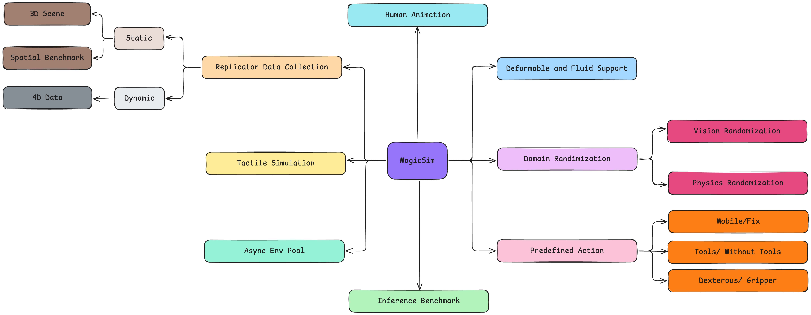
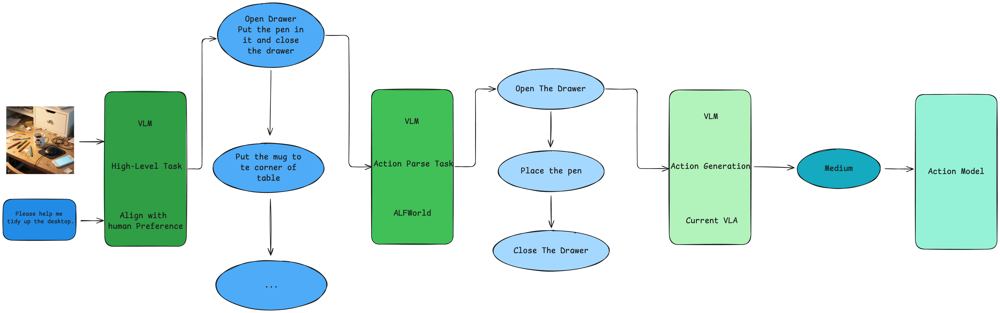

# MagicSim



<p align="center">
  <a href="https://roboverseorg.github.io"></a>
  <a href="https://arxiv.org/abs/2504.18904"></a>
  <a href="https://roboverse.wiki"></a>
  <a href="https://github.com/RoboVerseOrg/RoboVerse/issues"></a>
  <a href="https://github.com/RoboVerseOrg/RoboVerse/discussions"></a>
  <a href="https://discord.gg/6e2CPVnAD3"></a>
  <a href="docs/source/_static/wechat.jpg"></a>
</p>

## About project

This is the unified simulation environment for multi-stage researcher including the researcher focusing on low-level robotics action and robot learning as well as researcher focusing on high-level spatial reasoning, agent task and action parsers.

> We aim to build a unified simulation that can integrate different level of research into a whole framework. 

## Scope

An Indoor Simulation Environment including tactile, human simulation, deformable and fluid support. All function and Environment should be RL ready and Wrapped in Gym API.

## Multi-Level



<script src="https://cdn.jsdelivr.net/npm/image-map-resizer@1.0.10/js/imageMapResizer.min.js"></script>
<script>
  window.onload = function () {
    imageMapResize();
  };
</script>


## Acknowledgement
If you find this work useful in your research, please consider citing:

```bibtex
@misc{xxx,
      title={MagicSim}, 
      author={xxx},
      year={2025},
      eprint={xxx},
      archivePrefix={arXiv},
      primaryClass={xxx},
      url={xxx}, 
}
```

<!-- ## Table of Contents -->
```{toctree}
:hidden:
:titlesonly:

guide/index
<!-- benchmark/index -->
learn/index
<!-- API/index -->
<!-- FAQ/index -->
```